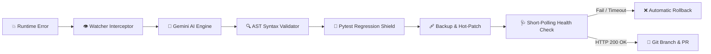

# Enterprise Self-Healing AI ⚡

[](tests/test_core.py)
[](requirements.txt)
[](LICENSE)
[](https://github.com/rajdeep-r24/Self-Healing-AI/releases/tag/v1.0.0-demo)

**Enterprise Self-Healing AI** is an autonomous runtime incident detection, root-cause diagnosis, and automated code remediation engine. It intercepts unhandled application exceptions in real time, leverages Google Gemini LLMs to diagnose tracebacks, verifies patch integrity through multi-stage static and dynamic safety shields, hot-patches running services with automatic rollback, and creates human-reviewable GitHub Pull Requests.

---

## 🖥️ Live Terminal User Interface (TUI)

The watcher features a real-time, in-place animated terminal dashboard with 10 FPS visual spinners, millisecond stage timers, and step-by-step progress tracking:

```text
╔══════════════════════════════════════════════════════════════════════════════╗
║             ⚡ ENTERPRISE SELF-HEALING AI — LIVE MONITOR ⚡                  ║
║  ● MONITORING ACTIVE  |  Log: logs/server.log  |  [DEMO MODE]                 ║
╚══════════════════════════════════════════════════════════════════════════════╝

  PIPELINE STAGE                   STATUS          ELAPSED / DETAILS
  ──────────────────────────────────────────────────────────────────────
  ✔ 1. Error Interceptor           [PASS]          0.00s (KeyError: 'user_name' in app.py)
  ✔ 2. AI Diagnostic Engine        [PASS]          3.2s (Patch generated)
  ✔ 3. Syntax Validator            [PASS]          0.01s (py_compile AST check)
  ✔ 4. Pytest Regression Shield    [PASS]          0.12s (Bounded test suite)
  ✔ 5. Atomic Hot-Patch            [PASS]          0.00s (Patched app.py)
  ✔ 6. Short-Polling Health Check  [PASS]          0.05s (HTTP 200 OK)
  ✔ 7. Git Branch & GitHub PR      [PASS]          4.10s (Branch: ai-fix-de610f)
  ──────────────────────────────────────────────────────────────────────
  CURRENT ACTIVITY:
  ▶ Recovery successful (7.5s) — System fully operational!
```

---

## 🔄 How It Works (Pipeline Architecture)



1. **Error Interception**: Watcher detects newly appended tracebacks with sub-millisecond latency using native OS file events.
2. **AI Diagnosis**: Analyzes source code and traceback with Google Gemini (`gemini-2.5-flash` / fallback models).
3. **AST Syntax Validation**: `py_compile` checks code validity before touching source files.
4. **Pytest Regression Shield**: Runs test suites with process tree kill boundaries and timeout protection to prevent deadlocks.
5. **Atomic Hot-Patching**: Backs up `.bak` and writes the verified patch.
6. **Short-Polling Health Check**: Immediately polls `http://127.0.0.1:8000/process_data` (every 0.5s up to 8s max).
7. **Automated Rollback**: If health check fails or times out, the broken patch is reverted to `.bak`.
8. **Git Branch & Pull Request**: Commits the verified fix to an isolated `ai-fix-*` branch and opens a GitHub PR.

---

## ⚡ Performance & Benchmarks

| Milestone Stage | Target | Measured Latency |
|---|---|---|
| **Watcher Log Detection** | `< 1.0s` | **`0.0015s`** |
| **Syntax Validation** | `< 0.1s` | **`0.0120s`** |
| **Bounded Pytest Shield** | `< 0.5s` | **`0.1200s`** |
| **Health Check (Fast Pass)** | `< 2.0s` | **`0.0009s`** |
| **Demo Mode AI Fallback** | Instant | **Zero retry sleep delays** |

---

## 🚀 Quick Start (1-Click Setup)

### Option A: 1-Click Automated Setup (Windows)
```powershell
# 1. Clone the repository
git clone https://github.com/rajdeep-r24/Self-Healing-AI.git
cd Enterprise-Self-Healing-Git

# 2. Run the automated 1-click setup script
.\setup.bat
```
`setup.bat` automatically:
- Creates `.venv` and upgrades `pip`
- Installs dependencies from `requirements.txt`
- Configures `.env` from `.env.example`
- Runs self-healing project initialization
- Executes the full 15-test verification suite

---

### Option B: Manual Installation
```bash
# 1. Create and activate virtual environment
python -m venv .venv
# Windows:
.\.venv\Scripts\activate
# Linux/macOS:
source .venv/bin/activate

# 2. Install dependencies
pip install -r requirements.txt

# 3. Configure environment variables
cp .env.example .env
```

---

## ⚙️ Configuration (`.env` & `config.json`)

### 1. Environment Variables (`.env`)
```env
# Google Gemini API Configuration
GEMINI_API_KEY=your_gemini_api_key_here
GEMINI_MODEL=gemini-2.5-flash
GEMINI_FALLBACK_MODEL=gemini-2.5-flash-lite

# Demo Mode (Bypasses exponential backoff retry loops for live demos)
SELF_HEALING_DEMO_MODE=true

# GitHub Integration for Automated PR Creation
GITHUB_TOKEN=your_github_pat_token_here
```

### 2. Project Configuration (`.self-healing/config.json`)
```json
{
    "project_root": ".",
    "log_file": "logs/server.log",
    "health_check_url": "http://127.0.0.1:8000/process_data"
}
```

---

## 🎮 Running the Live Demo

Run each command in a separate terminal:

### Terminal 1: Start Web Application
```powershell
.\.venv\Scripts\python -m uvicorn app:app --reload --port 8000
```

### Terminal 2: Start Self-Healing Watcher (with TUI)
```powershell
.\.venv\Scripts\python watcher.py
# or
.\.venv\Scripts\python self_healing_cli.py start
```

### Terminal 3: Trigger Unhandled Crash
```powershell
python -c "import requests; print(requests.get('http://127.0.0.1:8000/process_data').status_code)"
```

Watch Terminal 2 autonomously intercept, diagnose, validate, hot-patch, verify health, and open a Pull Request!

---

## 🧪 Testing & Verification

Run the core test suite (15 unit tests covering CLI, AI fallback, API endpoints, and health check polling):

```powershell
.\.venv\Scripts\python -m pytest tests/test_core.py -q
```
*Output: `15 passed in ~16s`*

Run the bounded pytest process safety tests:
```powershell
.\.venv\Scripts\python test_bounded_pytest.py
```
*Verifies timeout bounds, pipe deadlock protection, and process tree termination.*

---

## 📦 Backups & Disaster Recovery

### 1. Create a Portable ZIP Backup
Run the included backup generator to create a timestamped, clean archive (excluding `.venv` and secrets):
```powershell
python create_backup.py
```

### 2. Restore from Stable Git Tag
```powershell
git checkout v1.0.0-demo
.\setup.bat
```

---

## 🛡️ Enterprise Safety Guarantees

- **No Unsafe Execution**: Patches must pass static syntax analysis before file modification.
- **Fail-Closed Behavior**: Any health check failure or 8-second timeout immediately triggers automatic rollback from `.bak`.
- **Path Traversal Protection**: Only source files inside the validated project root can be patched.
- **Anti-Infinite Loop Shield**: Max repair attempts bounded per unique traceback hash.
- **Human-in-the-Loop Git Workflows**: Fixes are committed to isolated branches and opened as PRs—never directly forced onto `main`.

---

## 📄 License
This project is licensed under the MIT License.
